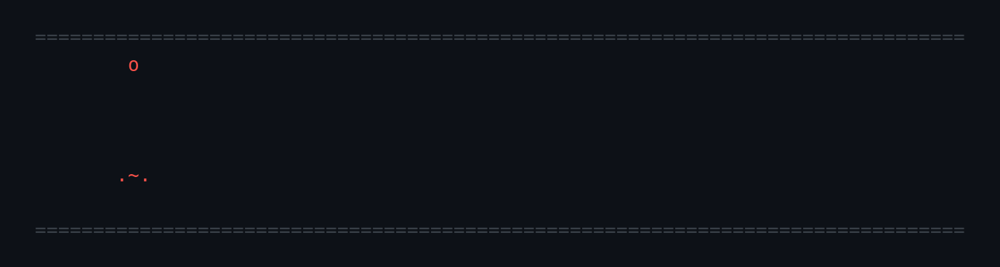

<p align="center">
  
</p>

# SignetOS (Work in Progress!!)

A capability-based microkernel for pure-capability CHERI RISC-V (RV64,
`-mabi=l64pc128d`), run under QEMU.

SignetOS depends on **Zyseal**, a CHERI RISC-V sealing extension that isn't
ratified (the `YSEAL`/`YUNSEAL` instructions). No released CHERI toolchain
has it, so you first build a patched LLVM and QEMU with
[`../zyseal/setup.sh`](../zyseal/setup.sh).

## 1. Build the CHERI toolchain

Install the prerequisites (Debian/Ubuntu), then run the Zyseal setup script
from the repository root:

```bash
sudo apt install -y cmake ninja-build clang lld python3 pkg-config \
                    libglib2.0-dev libpixman-1-dev flex bison

zyseal/setup.sh
```

The script takes about an hour and ~30 GB of disk, nearly all of it LLVM. It
uses [cheribuild](https://github.com/CTSRD-CHERI/cheribuild) to fetch the
upstream CHERI LLVM and QEMU, applies the patches in
[`zyseal/patches`](../zyseal/patches), and builds them. If it stops partway,
run it again: steps that are already done are skipped. See
[`zyseal/README.md`](../zyseal/README.md) for details.

Everything goes into `~/cheri` by default (set `CHERI_ROOT` to change that).
SignetOS uses these two outputs:

```
~/cheri/zyseal/llvm-build/bin/                         clang, ld.lld, llvm-objcopy, ...
~/cheri/zyseal/qemu-build/qemu-system-riscv64cheristd  emulator
```

## 2. Build and run SignetOS

From this directory (`signetos/`):

```bash
./run_signetos_terminal.sh
```

This does a clean build of the kernel and the disk image, then boots it in
QEMU with the serial console on your terminal. At the `SignetOS>` prompt,
`help` lists the commands. Type `shutdown` to power off, or press **Ctrl+A**
then **X** to kill QEMU.

You can also use `make` directly:

| Command | What it does |
|---|---|
| `make` | build `signetos.elf` and `disk.img` |
| `make term` | build if needed, then boot in QEMU on this terminal |
| `make TRACE_SWITCH=1 term` | the same, but log every thread switch |
| `make disk` | rewrite `disk.img` only |
| `make clean` | remove build outputs (keeps `disk.img`) |

`SMP=<n>` sets the number of harts (default 4). `disk.img` keeps any files the
system wrote on earlier boots; delete it to start fresh.

### Toolchain location

The Makefile finds the toolchain through `CHERI_ROOT`, which defaults to
`~/cheri`, the same default as `setup.sh`. If you ran `setup.sh` with a
different `CHERI_ROOT`, use the same value here:

```bash
export CHERI_ROOT=/opt/cheri
./run_signetos_terminal.sh
```

If your binaries live somewhere else entirely, set `CHERI_SDK_BIN` (the
directory that contains `clang`) and `QEMU` (the full path to
`qemu-system-riscv64cheristd`) instead.

## Troubleshooting

- **`CHERI clang not found at ...`**: the toolchain isn't where the Makefile
  is looking. Run `zyseal/setup.sh` (step 1) or set `CHERI_ROOT`.
- **clang rejects `-march=rv64gc_zcheripurecap_zyseal`**: you're using an
  unpatched compiler. Use the one from `$CHERI_ROOT/zyseal/llvm-build/bin`.
- **QEMU rejects `Zyseal=on`**: you're using an unpatched QEMU. Use
  `$CHERI_ROOT/zyseal/qemu-build/qemu-system-riscv64cheristd`.

## Layout

```
kernel/      the microkernel (boot, VM, traps, threads, sealing, syscalls)
include/     kernel headers and a minimal freestanding libc
user/        runtime and linker script shared by all user compartments
boot/        compartments embedded in the kernel: init, loader, fs, uart, blk
external/    compartments loaded from disk.img: services/ (naming, sched,
             trap_mgr, shell) and apps/ (programs the shell can `run`)
tools/       signetfs.py, which writes disk.img
```
